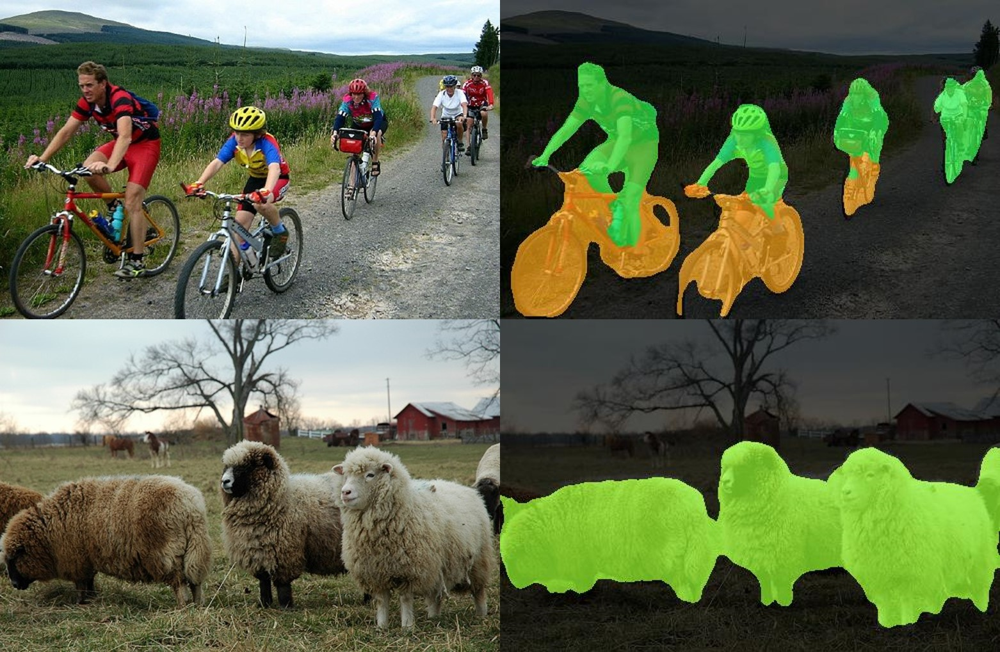

# DeepLabv3_plus
=======
# DeepLabV3+   pytorch
在[bubbliiing](https://github.com/bubbliiiing/deeplabv3-plus-pytorch)大佬代码的基础上进行了修改，添加了部分注释。该模型Backbone采用MobileNetv2网络。
## 图片检测demo
<br>

## 预训练模型
+ .pth格式的预训练模型如下。<br>
>- 链接：https://pan.baidu.com/s/1R6_qYknYQgP_PkK791zr8w
>- 提取码：xn68
## 训练自己的数据集
### 1. 按照VOC格式准备数据集
标签8位png文件放在VOCdevkit文件夹下的VOC2007文件夹下的SegmentationClass中。
图片JPG文件放在VOCdevkit文件夹下的VOC2007文件夹下的JPEGImages中。

在model_data文件夹下新建name_classes文件夹，第一行为background，其余依次写入需要分割的种类。
### 2. 划分数据集
运行：
``` bash
python voc_annotation.py
```
生成的数据集划分文件存放在VOCdevkit\VOC2007\ImageSets\Segmentation文件夹下。
### 4. 开始训练
将下载好的.pth格式预训练模型deeplab.pth文件放在model_data文件夹下。修改train.py下的classes_path及model_path指向，运行：
``` bash
python train.py
```
## 测试图片
修改utils/utils_deeplab.py文件中的model_path及classes_path，指向训练好的模型及类别信息。
在predict_images.py文件下输入图片路径，运行：
``` bash
python predict_images.py
```
## 获取模型mIoU
修改calculate_map.py文件中的classes_path,运行：
 ``` bash
 python get_miou.py
 ```
## Reference
https://github.com/bubbliiiing/deeplabv3-plus-pytorch
